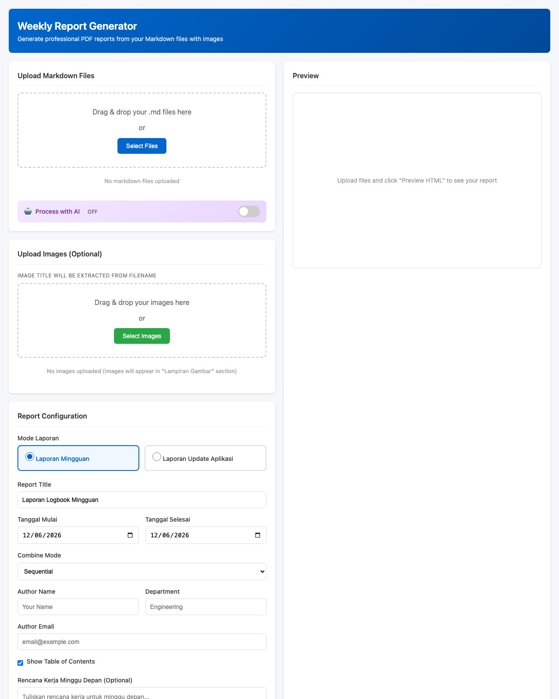

# Weekly Report Generator

Aplikasi web untuk menghasilkan laporan pekerjaan mingguan dalam format PDF dari file Markdown, dengan dukungan AI Google Gemini untuk memproses git log menjadi laporan kerja profesional.



## Fitur

- **Upload Markdown** - Drag & drop atau pilih file .md
- **Multiple Files** - Gabungkan beberapa file MD menjadi satu laporan
- **Google Gemini AI** - Konversi git log menjadi laporan kerja profesional
- **Auto-Sort by Date** - Urutkan konten secara kronologis (tanggal terlama ke terbaru)
- **Date Range Picker** - Pilih rentang tanggal laporan (dari - sampai)
- **Image Upload** - Tambahkan gambar/screenshot ke laporan
- **Template System** - Gunakan template untuk format yang konsisten
- **Custom Styling** - CSS styling untuk tampilan PDF profesional
- **Preview** - Lihat preview HTML sebelum generate PDF
- **Auto-Download** - PDF otomatis terdownload setelah generate
- **Auto-Reset** - Upload ter-reset setelah generate PDF

## Tech Stack

| Komponen | Teknologi |
|----------|-----------|
| Backend | FastAPI (Python) |
| Frontend | HTMX + Alpine.js |
| PDF Generation | WeasyPrint |
| Markdown Parser | Python-Markdown |
| Template Engine | Jinja2 |
| AI Processing | Google Gemini API |

## Instalasi

### Prasyarat

- Python 3.10+ (ARM64 untuk Apple Silicon)
- System dependency untuk WeasyPrint:
  - **macOS:** Homebrew + Pango
  - **Windows:** GTK3 Runtime (lihat langkah di bawah)
- Google Gemini API Key (opsional, untuk fitur AI)

> **Catatan WeasyPrint:** WeasyPrint membutuhkan library native (Pango, Cairo, GDK-PixBuf).
> `pip install` saja **tidak cukup** — jika library native belum terpasang, aplikasi akan
> gagal start saat meng-import WeasyPrint.

---

### Instalasi dengan Docker (Direkomendasikan)

Cara paling cepat dan portabel. Semua dependency (Python + library native WeasyPrint)
sudah dipaketkan di dalam image, jadi **tidak perlu install Python, Homebrew/Pango, atau
GTK3 secara manual.**

**Prasyarat:** [Docker](https://docs.docker.com/get-docker/) + Docker Compose (sudah termasuk
di Docker Desktop). `make` opsional — di macOS sudah tersedia, di Windows bisa lewat
WSL/Git Bash atau jalankan perintah `docker compose` langsung.

#### Pakai Make (paling singkat)

```bash
make setup       # buat .env dari .env.example (lalu edit & isi GEMINI_API_KEY bila perlu)
make up-build    # build image + jalankan di http://localhost:8000
```

Perintah lain yang tersedia (jalankan `make` untuk daftar lengkap):

| Perintah | Fungsi |
|----------|--------|
| `make up` | Jalankan app (pakai image yang sudah ada) |
| `make up-build` | Build ulang lalu jalankan |
| `make down` | Hentikan & hapus container |
| `make restart` | Restart app |
| `make logs` | Lihat log aplikasi (follow) |
| `make shell` | Masuk ke shell di dalam container |
| `make rebuild` | Build ulang tanpa cache lalu jalankan |
| `make clean` | Hentikan container + hapus image & volume |

#### Tanpa Make (langsung docker compose)

```bash
cp .env.example .env          # lalu edit & isi GEMINI_API_KEY bila perlu
docker compose up -d --build  # jalankan di http://localhost:8000
docker compose logs -f        # lihat log
docker compose down           # hentikan
```

> **Catatan:**
> - Folder `uploads/` dan `output/` di-mount sebagai volume, jadi file hasil generate
>   tetap tersimpan di host meski container di-restart.
> - Image **tidak** memakai `--reload` (mode production). Untuk fitur AI, pastikan
>   `GEMINI_API_KEY` terisi di `.env` — app tetap jalan tanpa key, hanya fitur AI yang non-aktif.

---

### Instalasi di macOS

1. **Masuk ke folder project**
   ```bash
   cd automatic_work_report_generation
   ```

2. **Install system dependencies**
   ```bash
   brew install pango
   ```

3. **Buat virtual environment**
   ```bash
   python3 -m venv venv
   source venv/bin/activate
   ```

4. **Install Python dependencies**
   ```bash
   pip install -r requirements.txt
   ```

5. **Setup environment variables**
   ```bash
   cp .env.example .env
   # Edit .env dan tambahkan GEMINI_API_KEY jika ingin menggunakan fitur AI (opsional)
   ```

6. **Jalankan aplikasi**
   ```bash
   uvicorn app.main:app --host 127.0.0.1 --port 8000 --reload
   ```

   > **Jika muncul error `cannot load library 'libgobject-2.0-0'`** (umum di Mac
   > dengan Python dari python.org / Apple Silicon): Python tidak otomatis mencari
   > library Homebrew. Jalankan dengan prefix env berikut:
   > ```bash
   > DYLD_FALLBACK_LIBRARY_PATH=/opt/homebrew/lib uvicorn app.main:app --host 127.0.0.1 --port 8000 --reload
   > ```
   > Agar permanen, tambahkan ke `~/.zshrc`:
   > ```bash
   > export DYLD_FALLBACK_LIBRARY_PATH="/opt/homebrew/lib:$DYLD_FALLBACK_LIBRARY_PATH"
   > ```
   > (Pada Mac Intel, lib Homebrew ada di `/usr/local/lib`.)

7. **Buka di browser**
   ```
   http://localhost:8000
   ```

---

### Instalasi di Windows

1. **Install GTK3 Runtime (WAJIB untuk WeasyPrint)**

   WeasyPrint di Windows membutuhkan GTK3 Runtime. Tanpa ini aplikasi tidak bisa jalan.

   - Download installer dari [GTK-for-Windows-Runtime-Installer](https://github.com/tschoonj/GTK-for-Windows-Runtime-Installer/releases) (file `gtk3-runtime-*-x64.exe`).
   - Jalankan installer, dan **centang opsi "Set up PATH environment variable"** agar GTK masuk ke PATH.
   - **Restart terminal / PowerShell** setelah instalasi agar PATH ter-update.

   > Alternatif: jika menggunakan MSYS2, jalankan `pacman -S mingw-w64-x86_64-pango`.

2. **Masuk ke folder project** (PowerShell atau Command Prompt)
   ```powershell
   cd automatic_work_report_generation
   ```

3. **Buat virtual environment**
   ```powershell
   python -m venv venv
   venv\Scripts\activate
   ```
   > Jika muncul error eksekusi script di PowerShell, jalankan sekali:
   > `Set-ExecutionPolicy -Scope CurrentUser RemoteSigned`

4. **Install Python dependencies**
   ```powershell
   pip install -r requirements.txt
   ```

5. **Setup environment variables**
   ```powershell
   copy .env.example .env
   # Edit .env dan tambahkan GEMINI_API_KEY jika ingin menggunakan fitur AI (opsional)
   ```

6. **Jalankan aplikasi**
   ```powershell
   uvicorn app.main:app --host 127.0.0.1 --port 8000 --reload
   ```
   > Saat pertama kali dijalankan, Windows Firewall mungkin meminta izin akses jaringan — pilih **Allow**.

7. **Buka di browser**
   ```
   http://localhost:8000
   ```

> **Fitur AI bersifat opsional.** Aplikasi tetap berjalan normal tanpa `GEMINI_API_KEY`;
> fitur "Use AI Processing" otomatis non-aktif jika API key tidak diisi.

## Penggunaan

### Via Web Interface

1. Buka `http://localhost:8000`
2. Upload file Markdown (drag & drop atau klik "Select Files")
3. (Opsional) Upload gambar untuk lampiran
4. Isi konfigurasi laporan:
   - Report Title
   - Tanggal Mulai & Tanggal Selesai
   - Author Name
   - Department
5. (Opsional) Aktifkan "Use AI Processing" untuk konversi git log dengan Gemini
6. Klik "Preview HTML" untuk melihat preview
7. Klik "Generate PDF" untuk mengunduh PDF

### Menggunakan Fitur AI

1. Ambil git log dari repository:
   ```bash
   git log --since="2025-12-22" --until="2025-12-24" > git-log-22-24-desember-2025.md
   ```

2. Upload file git log ke aplikasi
3. Centang "Use AI Processing"
4. AI akan mengkonversi git log menjadi laporan kerja profesional dengan:
   - Urutan kronologis (tanggal terlama ke terbaru)
   - Deskripsi yang mudah dipahami
   - Pengelompokan berdasarkan tanggal
   - Statistik perubahan

### Via API

#### Upload File

```bash
curl -X POST http://localhost:8000/api/upload \
  -F "files=@report.md"
```

Response:
```json
{
  "files": [
    {
      "file_id": "uuid-here",
      "original_name": "report.md",
      "size": 1234,
      "uploaded_at": "2025-12-30T10:00:00"
    }
  ],
  "message": "Successfully uploaded 1 file(s)"
}
```

#### Generate PDF

```bash
curl -X POST http://localhost:8000/api/reports/generate \
  -H "Content-Type: application/json" \
  -d '{
    "file_ids": ["uuid-here"],
    "template_name": "default_report.html",
    "css_files": ["default.css"],
    "variables": {
      "start_date": "2025-12-22",
      "end_date": "2025-12-24",
      "author_name": "John Doe",
      "department": "Engineering",
      "report_title": "Weekly Progress Report"
    }
  }'
```

Response:
```json
{
  "report_id": "uuid-here",
  "filename": "Weekly Progress Report_abc123.pdf",
  "size": 114962,
  "generated_at": "2025-12-30T10:00:00",
  "download_url": "/api/reports/uuid-here/download"
}
```

#### Process with AI

```bash
curl -X POST http://localhost:8000/api/ai/process \
  -H "Content-Type: application/json" \
  -d '{
    "file_id": "uuid-here"
  }'
```

Response:
```json
{
  "success": true,
  "original_file_id": "uuid-here",
  "processed_file_id": "new-uuid-here",
  "message": "File processed successfully with AI"
}
```

#### Download PDF

```bash
curl -O http://localhost:8000/api/reports/{report_id}/download
```

## API Reference

| Endpoint | Method | Deskripsi |
|----------|--------|-----------|
| `/` | GET | Web interface |
| `/health` | GET | Health check |
| `/api/upload` | GET | List uploaded files |
| `/api/upload` | POST | Upload MD files |
| `/api/upload/{file_id}` | DELETE | Delete file |
| `/api/upload/{file_id}/content` | GET | Get file content |
| `/api/images` | GET | List uploaded images |
| `/api/images` | POST | Upload images |
| `/api/images/{image_id}` | DELETE | Delete image |
| `/api/templates` | GET | List templates |
| `/api/templates/styles` | GET | List CSS styles |
| `/api/reports` | GET | List generated reports |
| `/api/reports/generate` | POST | Generate PDF |
| `/api/reports/{id}/download` | GET | Download PDF |
| `/api/reports/{id}` | DELETE | Delete report |
| `/api/preview/html` | POST | HTML preview |
| `/api/preview/pdf` | POST | PDF preview (stream) |
| `/api/ai/status` | GET | Check AI availability |
| `/api/ai/process` | POST | Process file with AI |

## Struktur Proyek

```
automatic_work_report_generation/
├── app/
│   ├── __init__.py
│   ├── main.py                    # FastAPI entry point
│   ├── config.py                  # Application settings
│   ├── api/
│   │   ├── routes/
│   │   │   ├── upload.py          # File upload endpoints
│   │   │   ├── images.py          # Image upload endpoints
│   │   │   ├── templates.py       # Template management
│   │   │   ├── reports.py         # PDF generation
│   │   │   ├── preview.py         # Preview endpoints
│   │   │   └── ai.py              # AI processing endpoints
│   │   └── schemas/
│   │       ├── upload.py          # Upload models
│   │       ├── report.py          # Report models
│   │       ├── template.py        # Template models
│   │       └── ai.py              # AI models
│   ├── core/
│   │   ├── file_manager.py        # File handling + filename mapping
│   │   ├── image_manager.py       # Image handling
│   │   ├── markdown_parser.py     # MD to HTML + auto-sort by date
│   │   ├── pdf_generator.py       # WeasyPrint wrapper
│   │   └── template_engine.py     # Jinja2 processing
│   └── services/
│       ├── report_service.py      # Business logic
│       └── gemini_service.py      # Google Gemini AI integration
├── templates/
│   └── default_report.html        # PDF template
├── static/
│   └── css/pdf/
│       └── default.css            # PDF stylesheet
├── frontend/
│   └── index.html                 # Web UI
├── uploads/                       # Uploaded files (temp)
├── output/                        # Generated PDFs
├── Dockerfile                     # Image build (Python + native deps WeasyPrint)
├── docker-compose.yml             # Service config + volume mapping
├── .dockerignore                  # File yang diabaikan saat build image
├── Makefile                       # Shortcut perintah Docker (make up, down, dst)
├── .env.example                   # Environment template
├── requirements.txt
├── .gitignore
└── README.md
```

## Template Variables

Variabel yang tersedia dalam template:

| Variable | Deskripsi | Contoh |
|----------|-----------|--------|
| `week_start_date` | Tanggal awal periode | December 22, 2025 |
| `week_end_date` | Tanggal akhir periode | December 24, 2025 |
| `author_name` | Nama penulis | John Doe |
| `author_email` | Email penulis | john@example.com |
| `department` | Departemen | Engineering |
| `report_title` | Judul laporan | Weekly Progress Report |
| `generation_date` | Tanggal generate | December 30, 2025 |
| `content` | Konten HTML dari MD | `<h1>...</h1>` |
| `toc` | Table of Contents | `<ul>...</ul>` |
| `show_toc` | Tampilkan TOC | true/false |
| `images` | List gambar lampiran | `[{title, file_path}]` |
| `next_week_plan` | Rencana minggu depan | HTML content |

## Combine Modes

Saat menggunakan multiple files:

| Mode | Deskripsi |
|------|-----------|
| `sequential` | File digabung berurutan dengan separator |
| `sectioned` | Setiap file menjadi section dengan header |
| `chaptered` | Setiap file menjadi chapter (page break) |

## Auto-Sort by Date

Aplikasi akan otomatis mengurutkan konten berdasarkan header tanggal:

**Sebelum (file asli):**
```markdown
## 24 Desember 2025
...
## 23 Desember 2025
...
## 22 Desember 2025
...
```

**Sesudah (otomatis diurutkan):**
```markdown
## 22 Desember 2025
...
## 23 Desember 2025
...
## 24 Desember 2025
...
```

Fitur ini bekerja dengan atau tanpa AI processing.

## Contoh Markdown Input

```markdown
# Weekly Progress Report

## Completed Tasks

- Implemented user authentication
- Fixed payment processing bug
- Updated API documentation

## In Progress

| Task | Status | ETA |
|------|--------|-----|
| Database optimization | 70% | Friday |
| Mobile integration | 50% | Next week |

## Code Changes

\`\`\`python
def calculate_metrics():
    return {"total": 100, "average": 50}
\`\`\`

## Blockers

1. Waiting for design approval
2. Need production access

## Next Week Goals

- Complete database optimization
- Start mobile app integration
```

## Struktur Markdown yang Direkomendasikan

Untuk **Laporan Mingguan**, struktur berikut menghasilkan PDF yang rapi dan mudah dibaca.
Contoh lengkap ada di [`examples/Laporan_Mingguan_2-6_JUN_2026.md`](examples/Laporan_Mingguan_2-6_JUN_2026.md).

**Konvensi nama file:** `Laporan_Mingguan_2-6_JUN_2026.md` — sertakan rentang tanggal & periode agar mudah ditelusuri.

```markdown
# Laporan Mingguan
**Periode: 2 – 6 Juni 2026**

---

## Ringkasan Umum

Paragraf singkat berisi gambaran besar pekerjaan minggu ini.

---

## Detail Pekerjaan

### Selasa, 2 Juni 2026

**Frontend - Omnichannel (Web)**
- Perbaikan cetak label yang rusak saat part number terlalu panjang

**Backend - Omnichannel**
- Penambahan cron job auto selesai pesanan
- Penambahan notifikasi perubahan status

---

### Rabu, 3 Juni 2026

**Frontend - Omnichannel (Web)**
- Perbaikan filter di halaman list penjualan

**Backend - Omnichannel**
- Penambahan unit test dan dokumentasi

---

## Rekap Pekerjaan

| Kategori | Jumlah Item |
|---|---|
| Penambahan Fitur | 14 |
| Perbaikan Bug / Logic | 8 |
| Perubahan Logic / UI | 5 |
| **Total** | **27** |
```

**Kenapa struktur ini bagus:**
- **Judul + Periode** di awal → jelas konteks laporan.
- **Ringkasan Umum** → pembaca paham gambaran besar tanpa baca semua detail.
- **Detail per hari** dikelompokkan per platform/kategori dengan label tebal (`**...**`).
- **Tabel Rekap** di akhir → ringkasan kuantitatif yang gampang dibaca.
- **`---`** sebagai pemisah antar bagian → tampil sebagai garis horizontal di PDF.

> **Tips auto-sort tanggal:** fitur auto-sort hanya mengenali header dengan format
> **`## D Bulan YYYY`** (angka tepat setelah `#`/`##`, mis. `## 2 Juni 2026`).
> Header deskriptif seperti `### Selasa, 2 Juni 2026` **tidak** ikut diurutkan otomatis —
> jadi pastikan kamu menulis harinya sudah berurutan, atau pakai format `## 2 Juni 2026`
> kalau ingin app yang mengurutkan.

> **Menyisipkan gambar:** gunakan `` di posisi yang diinginkan,
> lalu **upload gambarnya lewat "Upload Images"** dengan **nama file yang sama**. Cocok untuk
> mode **Laporan Update Aplikasi** (gambar tampil inline beserta caption).

### Tools untuk Menulis & Preview Markdown

Untuk menulis dan melihat preview file `.md` dengan nyaman, gunakan **VS Code** + ekstensi
**[Markdown Preview Enhanced](https://marketplace.visualstudio.com/items?itemName=shd101wyy.markdown-preview-enhanced)**:

- Install lewat tab Extensions di VS Code (cari "Markdown Preview Enhanced") atau jalankan:
  ```bash
  code --install-extension shd101wyy.markdown-preview-enhanced
  ```
- Buka file `.md`, lalu tekan **`Ctrl/Cmd + K`** diikuti **`V`** untuk membuka preview berdampingan.
- Preview-nya mendukung tabel, gambar, dan diagram — jadi kamu bisa cek tampilan laporan
  sebelum di-generate ke PDF.

## Environment Variables

| Variable | Deskripsi | Default |
|----------|-----------|---------|
| `GEMINI_API_KEY` | Google Gemini API Key | - |
| `GEMINI_MODEL` | Model Gemini yang digunakan | gemini-2.0-flash |
| `MAX_FILE_SIZE` | Ukuran maksimal file (bytes) | 10485760 (10MB) |
| `FILE_MAX_AGE_HOURS` | Umur file sebelum cleanup | 24 |

## Kustomisasi

### Menambah Template Baru

1. Buat file HTML di `templates/`
2. Gunakan variabel Jinja2 seperti `{{ report_title }}`
3. Template akan otomatis muncul di dropdown

### Menambah CSS Style

1. Buat file CSS di `static/css/pdf/`
2. Style akan otomatis muncul di API `/api/templates/styles`

### Contoh Custom CSS

```css
@page {
    size: A4;
    margin: 2cm;

    @top-center {
        content: "Company Report";
    }

    @bottom-center {
        content: "Page " counter(page);
    }
}

body {
    font-family: 'Helvetica', sans-serif;
    font-size: 11pt;
}

h1 {
    color: #0066cc;
    border-bottom: 2px solid #0066cc;
}
```

## Troubleshooting

### WeasyPrint Error: cannot load library

**macOS** — pastikan Pango terinstall:
```bash
brew install pango
```

**Windows** — error seperti `cannot load library 'libgobject-2.0-0'` atau `OSError: ... libpango`
berarti GTK3 Runtime belum terpasang atau belum masuk PATH:
- Install [GTK3 Runtime](https://github.com/tschoonj/GTK-for-Windows-Runtime-Installer/releases) dengan opsi "Set up PATH" dicentang.
- **Restart terminal** setelah instalasi.
- Pastikan menjalankan Python versi 64-bit (cocokkan dengan GTK 64-bit).

### Architecture Mismatch (Apple Silicon)

Gunakan Python dari Homebrew:
```bash
/opt/homebrew/bin/python3 -m venv venv
```

### File Upload Gagal

- Pastikan file berekstensi `.md` atau `.markdown`
- Maksimal ukuran file: 10MB

### AI Processing Error

- Pastikan `GEMINI_API_KEY` sudah diset di `.env`
- Cek status AI di `/api/ai/status`
- Jika rate limit, tunggu beberapa saat

### Command untuk mengambil log git

```bash
git log --since="2025-12-22" --until="2025-12-24" > git-log-22-24-desember-2025.md
```

Untuk format yang lebih detail:
```bash
git log --since="2025-12-22" --until="2025-12-24" --pretty=format:"%h - %an, %ar : %s" > git-log.md
```

## License

MIT License
